# Arazzo Specification Snippets and Images

This repo contains little Arazzo Specification YAML snippets. The snippets have been converted to PNG using [ray.so](https://www.ray.so/).

Additionally, there is an image overview of the Arazzo Specification, which was created using [Excalidraw](https://excalidraw.com/) and the raw `.exacalidraw` file is maintained here.

## Usage

Feel free to use or extend this work (referencing to this repo is preferred). PRs back with more examples are much appreciated 💚.

🌟 the repo if it's been useful for your work.

## Contents

| Name | Image | Metadata / Snippet YAML |
|------|-------|-------------------------|
|Arazzo Specification 1.0.1 Overview|  | [excalidraw snippet](./excalidraw/Arazzo-1.0.1.excalidraw) |
|Arazzo Specification Object Example | .png) | [YAML](./snippets/arazzo.yaml) |
| Arazzo Info Object Example | 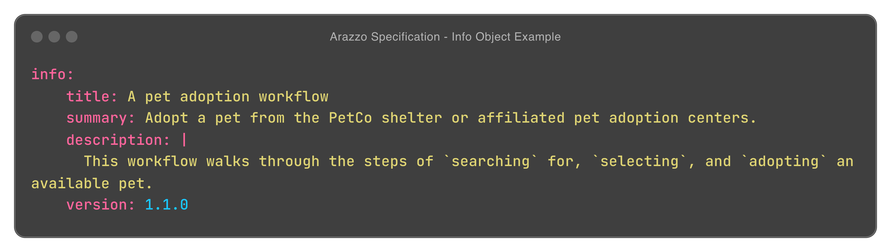 | [YAML](./snippets/info.yaml) |
| Arazzo Source Descriptions Example | 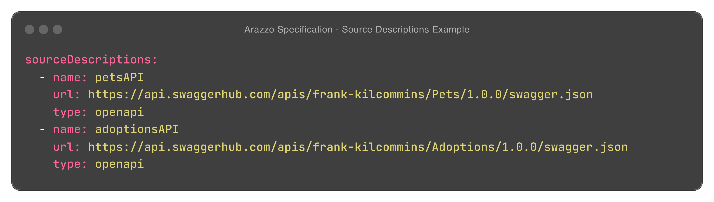 | [YAML](./snippets/sourceDescriptions.yaml) |
| Arazzo Workflows Example | 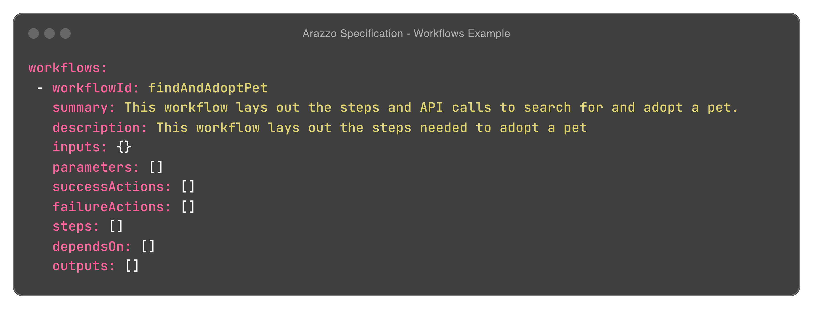 | [YAML](./snippets/workflowsObj.yaml) |
| Arazzo Workflow Inputs Example | 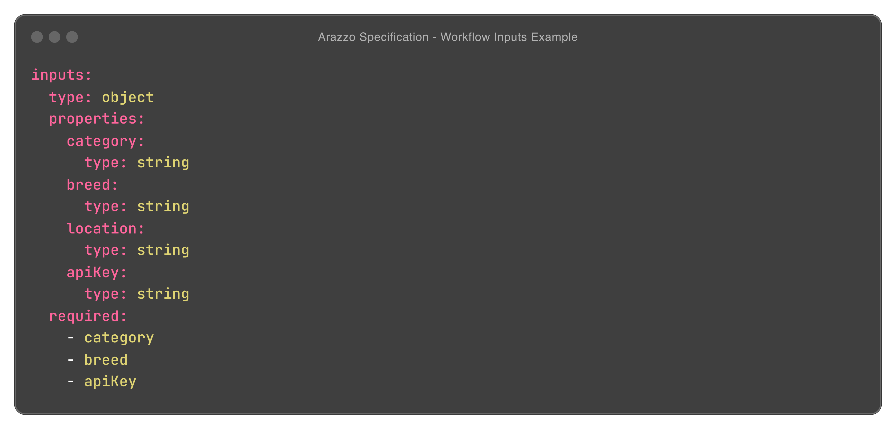 | [YAML](./snippets/inputs.yaml) |
| Arazzo Steps Example | 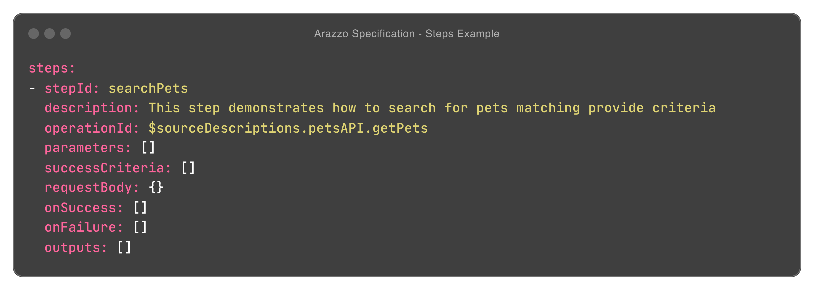 | [YAML](./snippets/steps.yaml) |
| Arazzo Step Parameters Example | 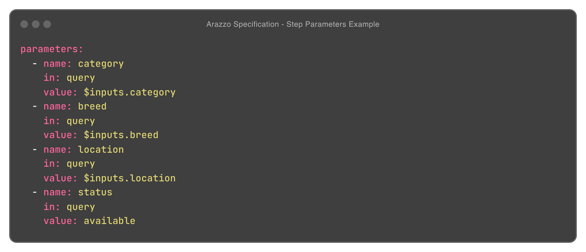 | [YAML](./snippets/parameters.yaml) |
| Arazzo Step Success Criteria Example | 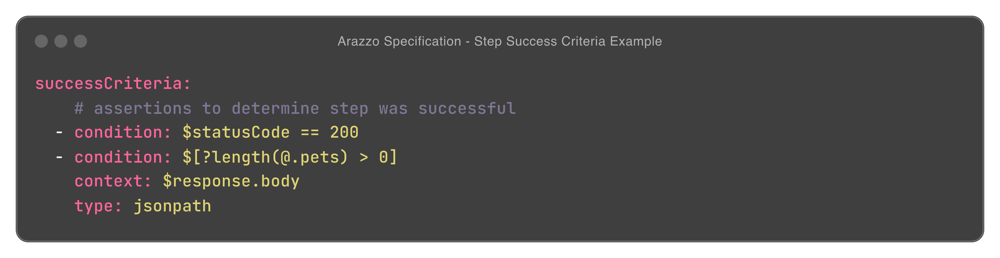 | [YAML](./snippets/successCriteria.yaml) |
| Arazzo Failure Action Example | 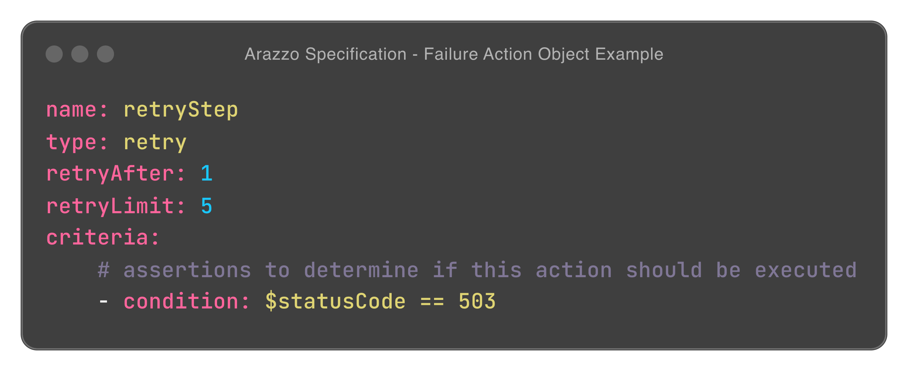 | [YAML](./snippets/failureAction.yaml) |
| Arazzo Success Action Example | 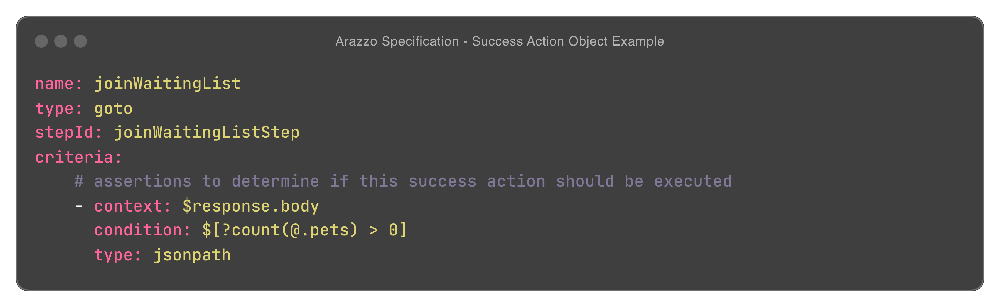 | [YAML](./snippets/successAction.yaml) |
| Arazzo Step Outputs Example | 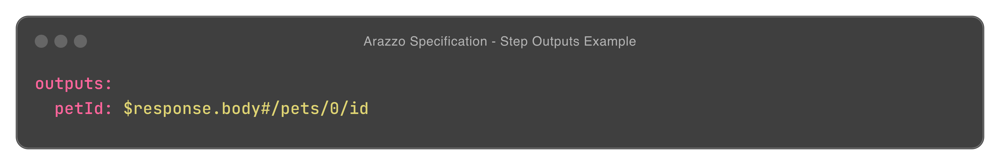 | [YAML](./snippets/stepOutputs.yaml) |
| Arazzo Workflow Outputs Example | 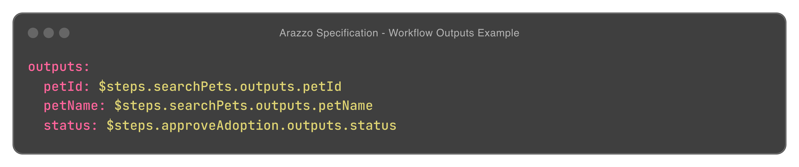 | [YAML](./snippets/outputs.yaml) |
